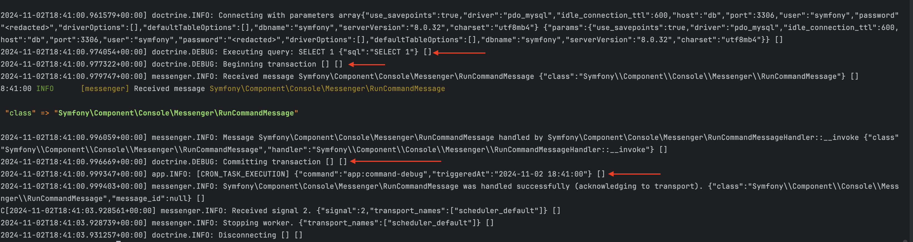
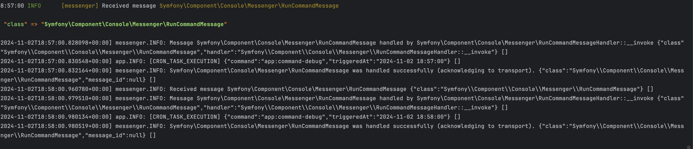

I hope you’re well. I’d like to report a potential issue with my current Symfony Scheduler configuration, 
specifically related to SQL transactions when using messenger.bus.command as the default_bus.


###  Configuration Overview
Here's my Messenger configuration for reference:

```yaml 
framework:
    messenger:
        # Uncomment this (and the failed transport below) to send failed messages to this transport for later handling.
        failure_transport: failed

        transports:
            # https://symfony.com/doc/current/messenger.html#transport-configuration
             async: '%env(MESSENGER_TRANSPORT_DSN)%'
             failed: 'doctrine://default?queue_name=failed'
             sync: 'sync://'

        routing:
            # Route your messages to the transports
            # 'App\Message\YourMessage': async
        default_bus: messenger.bus.command
        buses:
            messenger.bus.default:
            messenger.bus.command:
                middleware:
                    - doctrine_ping_connection
                    - doctrine_transaction
            messenger.event.bus:
                default_middleware:
                    enabled: true
                    # set "allow_no_handlers" to true (default is false) to allow having
                    # no handler configured for this bus without throwing an exception
                    allow_no_handlers: true
```

### Issue Description 1

I'm running a Symfony command, scheduled as a cron job to execute every minute. When I run the following command:

```bash
php bin/console messenger:consume scheduler_default -vvv
```

I observe that the entire Symfony command is encapsulated in an SQL transaction due to the default bus being set to messenger.bus.command.

Problem Scenario

If, for example, a command dispatches 100 messages, and an exception occurs on message 99, everything up to that point is rolled back. This behavior could cause significant issues with long-running commands or those processing numerous messages. I've attached a screenshot for reference.



Could you advise if there’s a way to handle partial failures or an alternative configuration to avoid full transaction rollback?

Thank you in advance for your guidance!


### Issue Description 2

I configured messenger.bus.default without any middleware, and this works as expected—there is no transaction involved.



However, I’m encountering an issue with DispatchAfterCurrentBusMiddleware. For instance, if a Symfony command dispatches 100 messages and each message then triggers an event using the DispatchAfterCurrentBusStamp, an error on message 99 will cause all 98 previous events to be lost. This appears to be due to how DispatchAfterCurrentBusStamp handles events in this context.


Try running App\Console\CommandDebug twice: once with an exception and once without.

```
messenger:consume scheduler_default --limit=1 -vvv 
```

You'll notice that when an exception occurs, all events for every message are lost.


Could you advise on how to prevent event loss in this scenario?